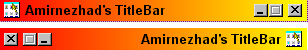



## Advanced TitleBar\(ActiveX Control\)

### Description

Add many properties to your program's TitleBar with this ActiveX Control.

Some of this properties are: Caption(Text, Color, Font) BachgroundPicture(Align, Picture, Show-or-Not) BachgroundColorStyle(Gradiant, Solid) Buttons(Max, Min, Close(Picture, DisablePicture, Show-or-Not, Enable-or-Not)), etc.

Enjoy! :)
 
### More Info
 

             |
---                |---
**Submitted On**   |2001-08-18 07:56:00
**By**             |[Ali Amirnezhad](https://github.com/Planet-Source-Code/PSCIndex/blob/master/ByAuthor/ali-amirnezhad.md)
**Level**          |Advanced
**User Rating**    |4.0 (16 globes from 4 users)
**Compatibility**  |VB 6\.0
**Category**       |[OLE/ COM/ DCOM/ Active\-X](https://github.com/Planet-Source-Code/PSCIndex/blob/master/ByCategory/ole-com-dcom-active-x__1-29.md)
**World**          |[Visual Basic](https://github.com/Planet-Source-Code/PSCIndex/blob/master/ByWorld/visual-basic.md)
**Archive File**   |[Advanced T248788172001\.zip](https://github.com/Planet-Source-Code/ali-amirnezhad-advanced-titlebar-activex-control__1-26332/archive/master.zip)

